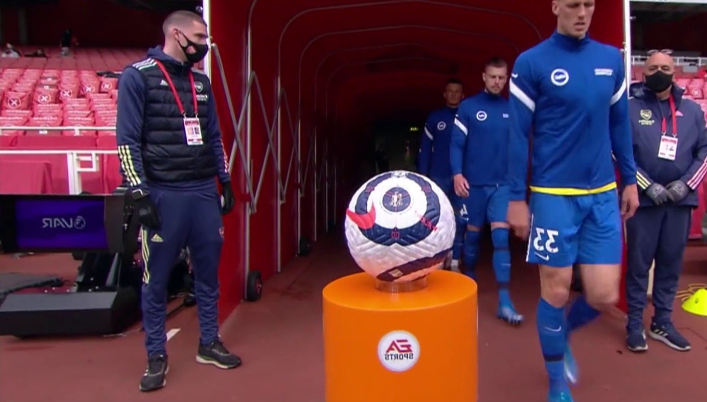
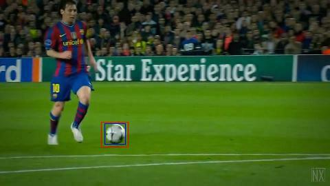
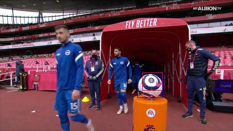
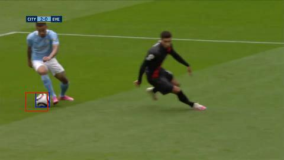

# Ball-recognition-model
  
## Cel projektu
Celem projektu jest stworzenie modelu do detekcji położenia piłki na obrazie, a więc taki który zwraca współrzędne futbolówki. 

## Słowo wstępne
Przyjętym założeniem jest, że piłka znajduje się na obrazku.
Projekt jest więc łatwo rozszerzalny -> można np. utworzyć drugi model klasyfikacyjny, a więc zwracający informację czy na danym obrazie znajduje się piłka, po czym oba te modele złączyć w jeden program. Może być to wykorzystywane przy odpowiednim wycięciu zdjęcia np. do zweryfikowania pozycji spalonej.

Model jest stworzony w oparciu o [keras](https://keras.io/), a więc API pozwalające na łatwe tworzenie customowych modelów. 
Użyte środowisko to [Google Colab](https://research.google.com/colaboratory/), który pozwala na wykonywanie kody na maszynach udostępnionych przez Google'a. 
Pod koniec wykonywania projektu zdecydowalismy się wybrać Google Colab w poszserzonej wersji, aby łatwiej było dostać pamięć RAM. 
Do repo dodane są też skrypty, które napisaliśmy, a bardzo ułatwiały pracę: 
  - png_to_jpg.py - prosty skrypt konwertujący wszyskie obrazy w wybranym folderze.
  - yt_cut.py - skrypt, który z filmiku na wejściu wycina co N-tą klatkę, dając dużą ilość zdjęć. 
Ostateczny model składa się z warstw jak poniżej, przetrenowany został na datasecie złożonym z ~53000 obrazów: 

Ale wszystko po kolei:

## Zebranie danych

Zdecydowaliśmy się na dane wysokiej jakości, aby piłka była dobrze widoczna. Na początku gromadziliśmy wszystkie dostępne zdjęcia, jednak potem zasadne było ograniczenie się do takich zdjęcia na których piłka jest wyraźna. Staraliśmy się tez wybierać z mała piłką jednak taka klasyfikacja nie ma sensu ze wzglądu na późniejsze przetwarzanie uniemożliwia znalezienie tylko kilku pikseli gdzie znajduje się futbolówka. Wybraliśmy piłki różnego rodzaju, z różnych rozgrywek m.in Premier League, mistrzostwa świata 2018, Liga Mistrzów. Nasz proces polegał na selekcji jakościowych momentów wycięcie ich i wycinanie odpowiednich klatek. Następnie zaznaczenie piłek tam gdzie występują. Korzystaliśmy z programu na którego wejście podawaliśmy co którą klatkę wycinamy i z których części pliku.

## Przygotowanie danych

Początkowo zgromadzono ~200 zdjęć oraz oznaczono piłke na każdym z nich, przy użyciu narzędzia [labelimg](https://github.com/tzutalin/labelImg).
Utworzono także pierwszy podstawowy model, jednak przewidywał on obiekt zawsze na środku obrazka nie ważne czy była to trawa czy piłkarz.
Przykłady: 

Po wynikach loss i validation loss mozna zobaczyć, że model się przeuczał: 

Najlepiej jednak dane te przedstawić w formie wykresu: 

Skąd wiadomo, że model jest przuczony?
W zasadzie wystarczy zobaczyć, że treningowy loss wciąż spada, a ten walidacyjny przestaje się już poprawiać.
Przykładowe wytłumaczenie na wiki:
[overfitting_wiki](https://en.wikipedia.org/wiki/Overfitting#Machine_learning)

Standardowo przy przeuczaniu trzeba zdobyc więcej danych treningowych, pomaga w tym augmentacja. 
(cyt. *Augmentacja danych polega na wprowadzeniu do materiału treningowego nieco zmodyfikowanych kopii istniejących danych, co zazwyczaj przekłada się pozytywnie na wyniki algorytmów uczenia maszynowego.*)

- W naszym przypadku augmentacja polegała na:
  - ucinaniu rogów obrazka -> daje to dwa nowe z jednego oraz powoduje, że piłki są bliżej krawędzi obrazków.
  - flipowaniu obrazków
  - zmianach w kontraście obrazków
  - zmianach w jasności obrazków

Z oryginalnego obrazka (FHD) powstały cztery nowe z przycięć (3/4 FHD) oraz flipów, a z nich 14 ze zmian w kontraście oraz jasności.
Model na wejście przyjmuje 270x480px (1/4FHD), do tych wymiarów orazki musiały byc skalowane, więc przycinanie rogów nie powodowało żadnych problemów.
Dataset treningowy powstał z dodania do siebie:
- oryginał + cropped + flipped + contrast + brightness
co daje:
- 1 + 1*4 + 4*14 = 429
Zebrano ~1300 zdjęć, a więc 61*1300=79300, jednak po cropie piłka nie zawsze znajdowała się na obrazku, więc niektóre trzeba było odrzucić.
Ostatecznie dataset miał w sobie ~53k zdjęć.

Problemem w tym momencie była pamięć RAM, bo wczytanie takiej ilości danych wymaga dużej ilości zasobów.
Jak dużej?
Zdjęcie jest wymiarów 270x480px, w formacie RGB, a więc każdy piksel przechowuje informację o tych trzech kolorach.
Powstały numpy.array ma więc wymiary ~53000x270x480x3, a każda z tych komórek jest wypełniona najmniejszym mozliwym floatem -> float16.
Najmniejszym, bo większy nie jest potrzebny.
Floatem, bo RGB przyjmuje wartości 0-255, ale potrzebna była normalizacja (o normalizacji jest info niżej)
Wystarczy więc pomnożyć wszystkie wymiary oraz 16 i wychodzi liczba bitów potrzebnej pamięci.
53000*270*480*3*16 bitów, co daje ~38Gb.

Trzeba więc, aby model czytał dane w locie i podawał do modelu, można to osiągnąć poprzez stworzenie dataseta oraz funkcji służącej jako wejściowy pipeline. 
[Użyta biblioteka do dataseta](https://www.tensorflow.org/datasets/api_docs/python/tfds) 
Po zrobieniu tego wyniki były już lepsze, jednak kilka rzeczy jeszcze zostało do zrobienia:
  - Normalizacja danych
  - Znalezienie najlepszego modelu  
Normalizacja została wykonana w zasadzie w trakcie robienia datasetu, polegała na tym, żeby zamienić zapis zdjęć z formy klasycznego RGB, a więc (0-255) na (0-1), jest to zrobione przy wejściowym pipelinie - tablica jest dzielona przez 255, a wykorzystywany typ danych to Float16.
Tak samo dla BBox'ów(Bouding Box - kwadraty wyznaczające położenie piłki, składające się z ((Xmin, Ymin), (Xmax, Ymax)), a więc dwóch punktów) wystarczyło przedzielic przez 480 -> najwiekszy wymiar obrazu.

Do szukania modelu użyto [autotuner'a](https://www.tensorflow.org/tutorials/keras/keras_tuner), który pozwala dobrać odpowiednie wawrtości dla w zasadzie wszystkiego, a więc liczby filtrów, liczby jednostek, szybkości uczenia, liczby warstw i wiele innych.
Przykładowe użycie: 

### Przykłady augmentacji

  - Obrazek oryginalny 
  
  - Ucięty dolny prawy róg (Crop1) 
  
  - Ucięty górny lewy róg (Crop2) 
  
  - Crop1 flipped 
  
  - Crop2 flipped 
  

## Model

- Model jest bazowany na warstwach splotowych, a więc składa się z warstw:
  - Conv2D -> wprowadzającej splot
  - MaxPooling2D -> zmieniającej rodzielczość obrazka
  - Dropout -> przepuszczającej tylko fragment danych (walka z przeuczeniem)
  - Dense -> w pełni połączone neurony
- ADAM optymalizator -> jest on najbardziej uniwersalny
- Autotuner -> narzędzie które pomaga ustalić odpowiednie wartości ilości filtrów w warstwach splotowych, unitów w warstwach dense oraz learning rate
- Rysowanie krzywej uczenia, (zmiany funkcji loss dla datasetu treningowego oraz walidacyjnego) pozwala to określić czy model się przeucza.

## Wyniki

Funkcja loss dobrego modelu: 

Przykłady zdjęć z przewidywaniami: 

## Przykłady działania, na 100 zdjęciach ze zbioru walidacyjnego
</img> 
</img> 
</img> 
</img> 
</img> 
  
</img> 
</img> 
</img> 
</img> 
</img> 
  
</img> 
</img> 
</img> 
</img> 
</img> 
  
</img> 
</img> 
</img> 
</img> 
</img> 
  
</img> 
</img> 
</img> 
</img> 
</img> 
  
</img> 
</img> 
</img> 
</img> 
</img> 
  
</img> 
</img> 
</img> 
</img> 
</img> 
  
</img> 
</img> 
</img> 
</img> 
</img> 
  
</img> 
</img> 
</img> 
</img> 
</img> 
  
</img> 
</img> 
</img> 
</img> 
</img> 
  
</img> 
</img> 
</img> 
</img> 
</img> 
  
</img> 
</img> 
</img> 
</img> 
</img> 
  
</img> 
</img> 
</img> 
</img> 
</img> 
  
</img> 
</img> 
</img> 
</img> 
</img> 
  
</img> 
</img> 
</img> 
</img> 
</img> 
  
</img> 
</img> 
</img> 
</img> 
</img> 
  
</img> 
</img> 
</img> 
</img> 
</img> 
  
</img> 
</img> 
</img> 
</img> 
</img> 
  

## Opiekun Merytoryczny
<table align="center">
  <tr align="center">
    <td>Jarosław 'Dzik Merytoryczny' Bułat</td>
  </tr>
  <tr align="center">
    <td></td>
  </tr>
</table>

## Autorzy

<table>
  <tr align="center">
    <td>Kamil 'Mufasa' Sobolak</td>
    <td>Kacper 'Whitecore' Zemła</td>
    <td>Marek 'Legio' Kwak</td>
  </tr>
  <tr align="center">
    <td></td>
    <td></td>
    <td></td>
  </tr>
</table>
