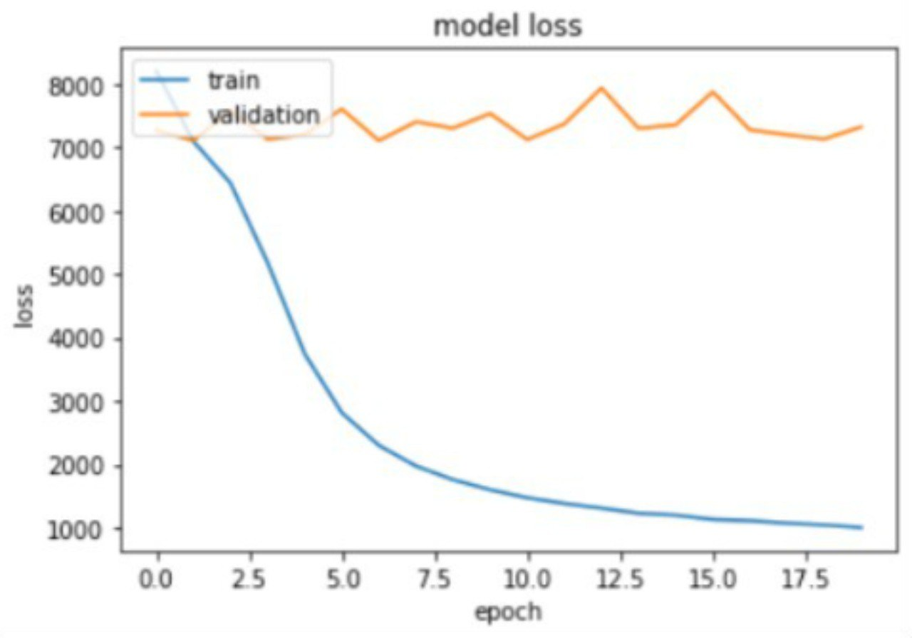
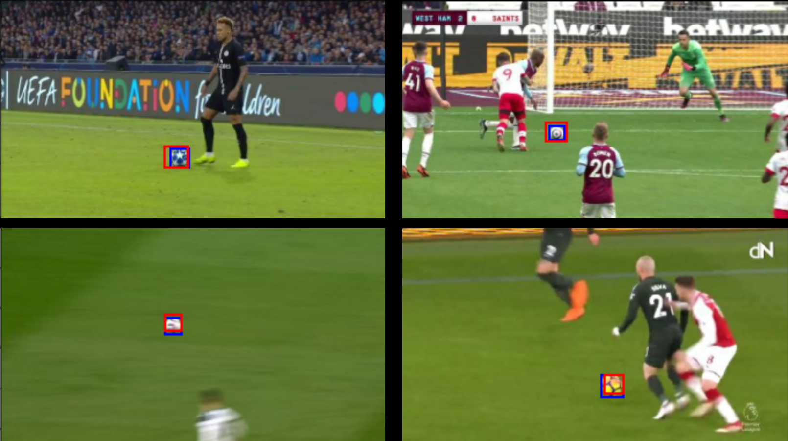

# Ball-recognition-model

Celem projektu jest stworzenie klasyfikatora obrazów opartego o sieć splotową. Przygotowaliśmy i wytrenowaliśmy model wykrywający piłki z meczów piłkarskich. Czy będzie to najnowszy model, czy zwykła biedronka na pewno sobie poradzimy.

#### Zebranie danych

Zdecydowaliśmy się na dane wysokiej jakości, aby piłka była dobrze widoczna. Na początku gromadziliśmy wszystkie dostępne zdjęcia, jednak potem zasadne było ograniczenie się do takich zdjęcia na których piłka jest wyraźna. Staraliśmy się tez wybierać z mała piłką jednak taka klasyfikacja nie ma sensu ze wzglądu na późniejsze przetwarzanie uniemożliwia znalezienie tylko kilku pikseli gdzie znajduje się futbolówka. Wybraliśmy piłki różnego rodzaju, z różnych rozgrywek m.in Premier League, mistrzostwa świata 2018, Liga Mistrzów. Nasz proces polegał na selekcji jakościowych momentów wycięcie ich i wycinanie odpowiednich klatek. Następnie zaznaczenie piłek tam gdzie występują.

#### Przygotowanie danych

Początkowo zgromadzono ~200 zdjęć oraz oznaczono piłke na każdym z nich, przy użyciu narzędzia[labelimg](https://github.com/tzutalin/labelImg)
Utworzono także pierwszy podstawowy model, jednak przewidywał on obiekt zawsze na środku obrazka nie ważne czy była to trawa czy piłkarz. Udało nam się z tym poradzić gromadząc większą ilość danych wejściowych oraz augmentacją.

- Zmniejszenie przeuczenia -> tworzenie większej ilości danych(obrazków treningowych) poprzez:
  - ucinanie rogów obrazka -> daje to dwa nowe z jednego oraz powoduje, że piłki są bliżej krawędzi obrazków.
  - flipowanie obrazków
  - zmiany w kontraście obrazków
  - zmiany w jasnoście obrazków

Z oryginalnego obrazka (FHD) powstały cztery nowe z przycięć (3/4 FHD) oraz flipów, a z nich 14 ze zmian w kontraście oraz jasności.
Model na wejście przyjmuje 270x480px (1/4FHD), dataset treningowy powstał z dodania do siebie:
- oryginał + cropped + flipped + contrast + brightness
co daje:
- 1 + (1*4) + (4*14) = 61
Zebrano ~1300 zdjęć, a więc 61*1300=79300, jednak po cropie piłka nie zawsze dalej znajdowała się na obrazku, a więc ostatecznie dataset miał w sobie 52960

Problemem w tym momencie była pamięć RAM. Rozwiązaniem okazał się dataset oraz pipeline wejściowy do modelu, co pozwala na niewczytywanie wszystkiech obrazków do pamięci.

### Przykłady

  - Obrazek oryginalny
  
  - Ucięty dolny prawy róg (Crop1)
  
  - Ucięty górny lewy róg (Crop2)
  
  - Crop1 flipped
  
  - Crop2 flipped
  

#### Model

- Model jest bazowany na warstwach splotowych, a więc składa się z warstw:
  - Conv2D
  - MaxPooling2D
  - Dropout
  - Dense
- ADAM optymalizator - jest on najbardziej uniwersalny
- Autotuner -> narzędzie które pomaga ustalić odpowiednie wartości ilości filtrów w warstwach splotowych, unitów w warstwach dense oraz learning rate
- Rysowanie krzywej uczenia, (zmiany funkcji loss dla datasetu treningowego oraz walidacyjnego) pozwala to określić czy model się przeucza.

#### Wyniki

Funkcja loss dobrego modelu:

Przykłady zdjęć z przewidywaniami:

  #### Autorzy
  Kamil 'Mustafa' Sobolak
  

  Kacper 'Whitecore' Zemła
  

  Marek 'Legio' Kwak
  